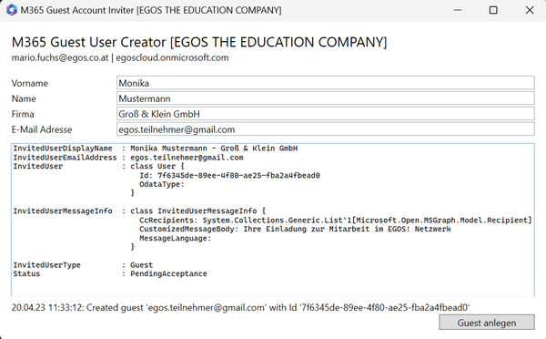
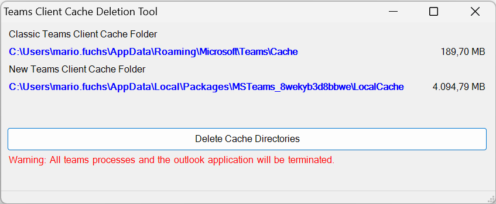

# EnterpriseScripts.Public

## Endpoint Manager/Intune
### Custom Compliance Script
>intune-custom-compliance.ps1

Device Compliance Script to check free disk space on endpoint and set a compliance state. Consists of PowerShell Script to check and compliance JSON to evaluate condition.

## Microsoft 365
### Guest Creator GUI
>m365-guest-creator.ps1

WPF Gui for Guest Creation

### Teams Client Cache Cleanup Script
>Clear-TeamsCache.ps1

Clear the teams cache of both (1.x, 2.x) client versions on Windows

## Exchange
### Fun with SMTP
> smtp-fun.ps1

Sending SMTP Command to a Mail Server for connector check. This is done with a TCPClient.
